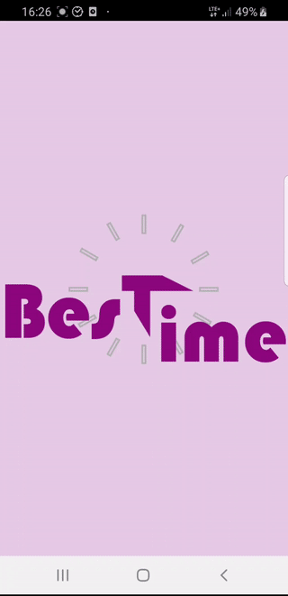
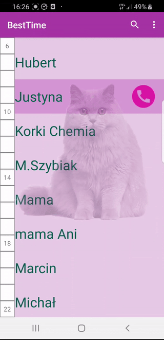
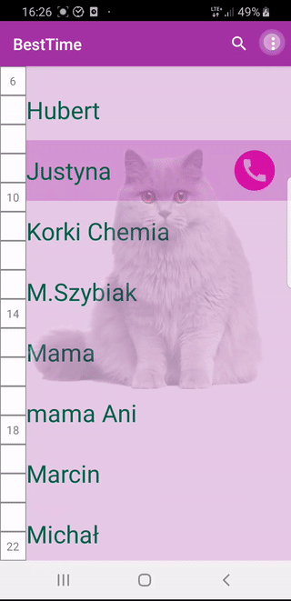

# Best Time

## Short desc

In this app you can check your contact's availability.

Calling is done using __whatsapp__, on the list there are only contacts callable by it.

On the first call from __Best Time__ it send SMS to chosen contact with link to form in which SMS receiver can fill when he is available to talk.

Then all the data is being fetched by __Best Time__ and displayed on the hours side bar.

Colours meaning:
- available - _pink_    
- perhaps available - _purple_
- not available - _gray_
- not enough data - _white_

## Presentation

- Launching

    

- Contact search

    

- Options

    
